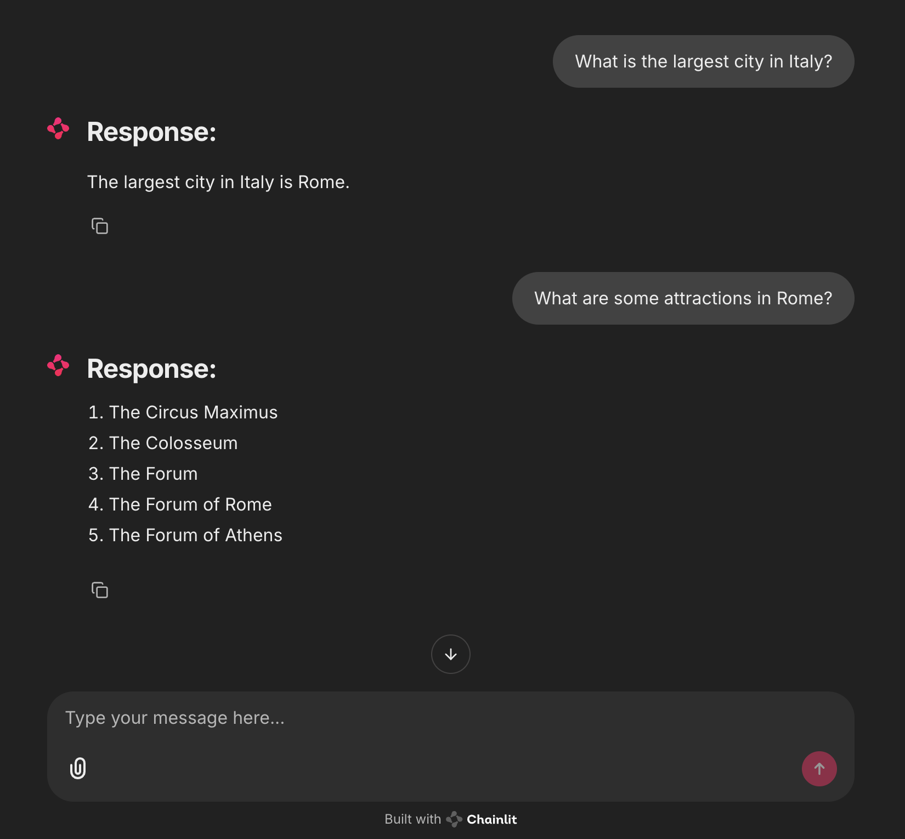

# LLM-Project

This repository documents my step-by-step journey toward building and fine-tuning a large language model (LLM) from scratch, inspired by the book:

> **Raschka, Sebastian. _Build A Large Language Model (From Scratch)_. Manning, 2024. ISBN: 978-1633437166**

The project is organized into chapters, each corresponding to a Jupyter Notebook or script that focuses on a key stage in the LLM development pipeline- from tokenization and embeddings to transformer architecture, training, evaluation, and user interaction.

---

## 🔧 Project Overview

This LLM implementation is based on a custom-built GPT-style transformer, trained and fine-tuned using PyTorch. My version includes:

- 🧱 **Custom model architecture** (`GPTModel`) with positional and token embeddings, transformer decoder blocks, and a causal attention mechanism.
- 📜 **Tokenizer integration** using `tiktoken`, with support for converting between text and token IDs.
- 🧠 **Finetuning on instruction-following data**, resulting in the checkpoint `gpt2-medium355M-sft.pth` (not pushed due to GitHub size limits).
- 🧪 **Training and validation loss tracking** to monitor performance and generalization.
- 💬 **Interactive Chainlit UI** for running the model in a ChatGPT-style interface.
- ⚙️ **Model loading utilities** for inference using your own `.pth` weights.

### UI Demo

---

## 📁 Repository Structure

	LLM-project/
 		preprocessing/
   		attention/
     	generation/
       	training/
	 	finetuning/
   		instructions/
     		instructions.ipynb # instruction-tuned Alpaca-style finetuning
			evaluation.ipynb # LLaMa-3.2B-based evaluation of model outputs
   		ui/
     		app.py
			model/
   				generate.py
       			gpt.py
	   			model_config.py
       			tokenizer_utils.py
	   			
---

## 💡 Project Summary

The goal of this project is to understand and implement all major components of a transformer-based language model. From raw text preprocessing to training on unlabeled data, and ultimately instruction-tuning, this repo captures the full LLM development pipeline.

### Key Accomplishments

- 🧱 Implemented a full decoder-only GPT architecture
- 📊 Trained and validated the model using cross-entropy loss
- 📎 Fine-tuned on supervised and instruction-following datasets
- 💬 Deployed a real-time chat interface using Chainlit
- 🔍 Evaluated outputs using LLaMA 3.2B and discussed limitations

---

## 📈 Training and Evaluation

* Training loss and validation loss are computed via cross-entropy, comparing predicted token distributions to actual next tokens.
* The project tracks loss over time to monitor generalization and overfitting.
* Later-stage evaluation is done using instruction-based prompts and judged with LLaMA 3.2B, though stronger models (e.g. OpenChat or Mistral) will be used for future, bigger models for more reliable scoring.

---

## Future Goals
* Increase weight parameters and size.
* Use newer and more efficient algorithms to build model architecture.
* Connect with interested companies and individuals to enhance outdated systems.

## Contact

Feel free to open an issue or discussion if you want to contribute, ask questions, or build on this work! Also feel free to contact me via email at amirvalizadeh161@gmail.com.

## Citation

Raschka, Sebastian. *Build A Large Language Model (From Scratch)*. Manning, 2024.
ISBN: 978-1633437166
